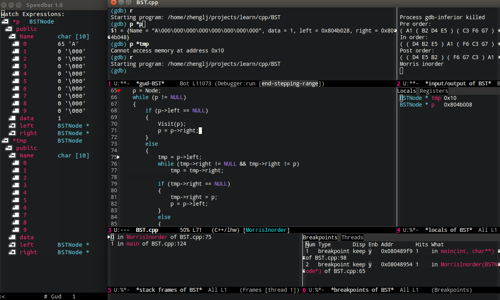
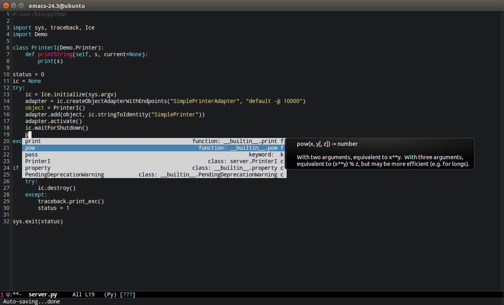
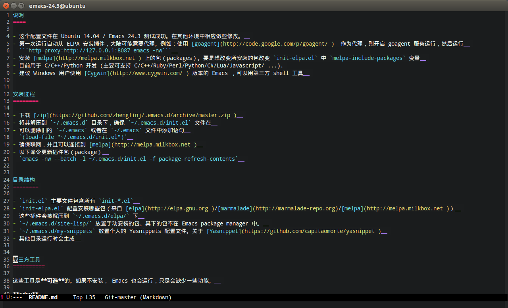

说明
====

- 这个配置文件在 Ubuntu 14.04 / Emacs 24.3 环境可行。在其他环境中相应做些修改。  
- 第一次运行自动从 ELPA 安装插件，大陆可能需要代理。例如：使用 [goagent](http://code.google.com/p/goagent/ )  作为代理，则开启 goagent 服务运行，然后运行  
  ```http_proxy=http://127.0.0.1:8087 emacs -nw```  
- 安装 [melpa](http://melpa.milkbox.net ) 上的包（packages）。要是想改变所安装的包改变 `init-elpa.el` 中 `melpa-include-packages` 变量  
- 目前用于 C/C++/Python 开发 (主要可支持 C/C++/Ruby/Perl/Python/C#/Lua/Javascript/ ...).
- 建议 Windows 用户使用 [Cygwin](http://www.cygwin.com/ ) 版本的 Emacs ，可以用第三方 shell 工具  

快照
====

**C/C++** 

 

**Python** 



**写文档** 

 

安装过程
========

- 下载 [zip](https://github.com/zhenglinj/.emacs.d/archive/master.zip )  
- 将其解压到 `~/.emacs.d` 目录下，确保 `~/.emacs.d/init.el` 文件在  
- 可以删除旧的 `~/.emacs` 或者在 `~/.emacs` 文件中添加语句  
  `(load-file "~/.emacs.d/init.el")`  
- 确保联网，并且可以连接到 [melpa](http://melpa.milkbox.net )  
- 以下命令更新插件包（package）  
  `emacs -nw --batch -l ~/.emacs.d/init.el -f package-refresh-contents`  


目录结构
========

- `init.el` 主要文件包含所有 `init-*.el`  
- `init-elpa.el` 配置安装哪些包（来自 [elpa](http://elpa.gnu.org )/[marmalade](http://marmalade-repo.org)/[melpa](http://melpa.milkbox.net )）  
  这些插件会被解压到 `~/.emacs.d/elpa/` 下  
- `~/.emacs.d/site-lisp/` 放置手动安装的包。其下的包不在 Emacs package manager 中。  
- `~/.emacs.d/my-snippets` 放置个人的 Yasnippets 配置文件。关于 [Yasnippet](https://github.com/capitaomorte/yasnippet )  
- 其他目录运行时会生成  


第三方工具
==========

必须安装
--------

**[cedet](http://cedet.sourceforge.net/ )**  
- CEDET is a Collection of Emacs Development Environment Tools written with the end goal of creating an advanced development environment in Emacs.  

**[GNU Global](http://www.gnu.org/software/global)**  
- needed by `gtags`  
- You use this tool to navigate the C/C++/Java/Objective-C code.  
- install through OS package manager  

**pyflakes**  
- You need pyflakes for real time python syntax checker like `flymake-python`  
- Install pip through OS package manager, then `pip install pyflakes`  
- On cygwin you need install `setuptool` in order to install `pip`.  

**virtualenv**  
- `pip install virtualenv`  

可选安装
--------

这些工具是**可选**的。如果不安装， Emacs 也会运行，只是会缺少一些功能。  

**sdcv**  
- StarDict Console Version  
- install through OS package manager  

**w3m (web browser in console)**  
- needed by `w3m` (w3m is emacs package name written in elisp)  
- install through OS package manager  
- please note only emacs with GUI can display image  

**lua**  
- required by `flymake-lua`  
- install through OS package manager  

**aspell or hunspell (RECOMMENDED), and corresponding dictionary (aspell-en, for example)**  
- needed by `flyspell`  
- hunspell is the alternative of `aspell`. So you need only install either aspell or hunspell.  
- install through OS package manager  
- I force the dictionary to "en_US" in init-spelling.el. You can modify it in init-spelling.el.  

**sbcl (lisp environment)**  
- needed by lisp `slime`  
- install through OS package manager  

**tidy (html tidy program)**  
- needed by `web-mode` for real time HTML syntax check  
- install through OS package manager  

**csslint**  
- install `node.js` through OS package manager, then `sudo npm install -g csslint`  

**zip and unzip**  
- needed by `org-mode` to export org to odt  
- install through OS package manager  

**xsel**  
- needed by my clipboard command `copy-to-x-clipboard` and `paste-from-x-clipboard` under Linux  
- install through OS package manager  

**[Clang](http://clang.llvm.org)**  
- needed by `cpputils-cmake`, `flymake`, `company-clang`  
- install through OS package manager  
- If you use `company-clang` (default), add `(setq company-clang-arguments '("-I/example1/dir" "-I/example2/dir"))` into ~/.emacs.d/init.el  
- If you use `cpputils-cmake` and `cmake`, `cpputils-cmake` will do all the set up for you.  

**[Ctags](http://ctags.sourceforge.net)**  
- needed by many tags related plugins  
- install through OS package manager  

**libreoffice**  
- Only one executable `soffice` needed when converting odt file into doc (Microsoft Word 97)  
- conversion will happen automatically when exporting org-mode to odt  
- The conversion command is in variable `org-export-odt-convert-processes`  
- Install through OS package manager  

快捷键
------

[常用快捷键定义](./doc/shutcut.md ) 

特征
----

- 优化了用 CMake 管理 C++ 开发  
- 部分快捷键仿照 Visual Studio 定义，C/C++ 开发调试时所用的快捷键  
- 实时的语法检错（C/C++ 根据 Makefile， Python 需要安装 pyflakes, HTML 需要安装 tidy）  
- Yasnippet 经个人定制，在 my-snippets 文件夹下  

<!-- - Real time HTML syntax checker enabled (you need install tidy)   -->
<!-- - git or subversion is *NOT* needed. You *DONOT* need run 'git submodule update'.   -->
<!-- - optimized for cross-platform C++ development with CMake and wxWidgets   -->
<!-- - emacs-w3m (console browser)   -->
<!-- - ibus (Chinese pinyin input method)   -->
<!-- - org2blog (post wordpress blog with org-mode)   -->
<!-- - make the configuration work on *ALL* platforms (Linux/Cygwin/Mac).   -->
<!-- - The configuration work with Emacs version >=24 but still usable with Emacs version 23 (tested with Emacs 23.4.1).   -->
<!-- - yasnippet and my customized snippets (insert code snippet by typing less keys)   -->


建议
====

- `M-x list-packages` 手动安装包插件，或者只要 `M-x package-refresh-content` 再重启 Emacs.  
- 使用轻量级的 Emacs 加快启动速度。在 `~/.bashrc` 中添加语句  
  `alias e=emacs -q --no-splash --eval="(setq light-weight-emacs t)" -l "$HOME/.emacs.d/init.el"`   
- 关于中文输入法，建议使用操作系统的输入法 (Ubuntu 12 使用 ibus 不要屏蔽 `init.el` 中关于 ibus 的配置文件 `init-ibus.el` ，具体查看 [emacswiki](http://www.emacswiki.org ) 关于 ibus 的配置 )  


包管理工具建议
--------------

- Cygwin 环境[apt-cyg](https://github.com/cfg/apt-cyg)  
- Linux 环境任何包管理工具  

<!-- - Mac 环境[homebrew](https://github.com/mxcl/homebrew) -->

关于Bug
======

在 [https://github.com/zhenglinj/.emacs.d](https://github.com/zhenglinj/.emacs.d ) 提交 bug  


个人定制custom.el (可选)
========================

